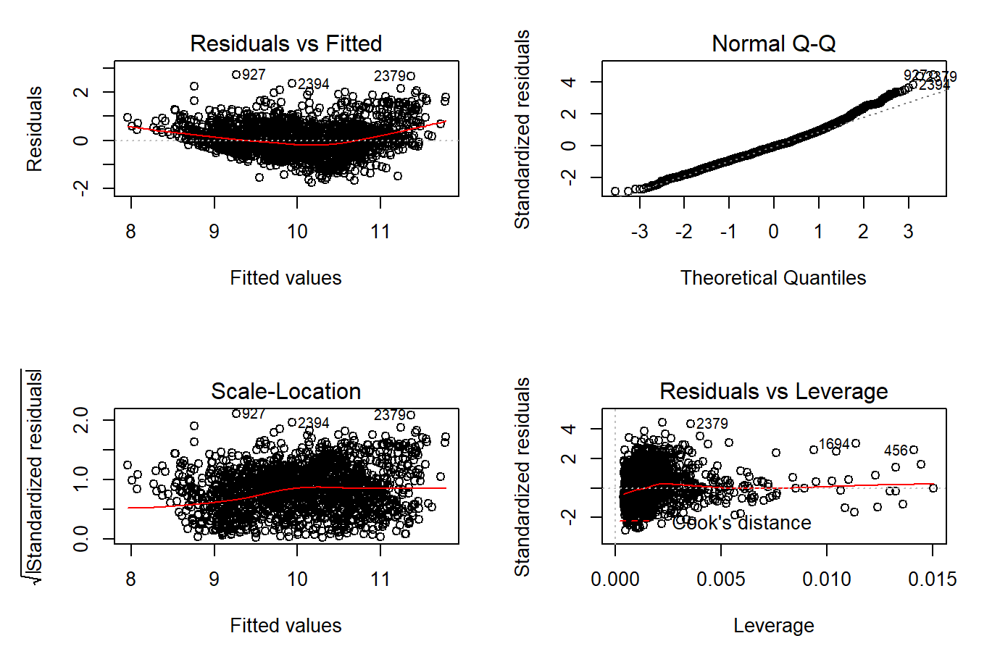

# Multiple Linear Regression Wine Model

_Authors: Andrew Bridglall, Brendan Tong, Darren Jian, Youngjun Oh_

## Description

To discern how specific wine components affected wine alcohol content, we utilized randomized [red and white wine datasets](https://archive.ics.uci.edu/ml/machine-learning-databases/wine-quality/) to draw conclusions about the relationship between variables like density, chlorides, and sulphates and the wine’s alcohol level through a multiple regression method. We first chose predictor variables with the best correlations and transformed any predictors with heavy clustering with a logarithmic function and a square root function, ultimately settling for a square root of the chlorides and sulphates predictor variables. We then ran simple linear regressions, but determined that all of our simple linear regression models were not sufficient.

This led us to implement a multiple regression model using our selected predictor variables, which we optimized by removing pH as a predictor variable. We checked to see if each of the linear model assumptions were met and concluded that the data lacked significant support for the linearity, independence, or homoscedasticity assumptions. Yet, despite the flawed data, we decided to accept the assumptions and continue with our multiple regression model.

As a result, we have three main takeaways. First, we found our white-wine-multiple regression model to be more reliable than the simple linear regressions. Second, we found the predictability of white wine alcohol level to be more successful than the red wine alcohol level based on our white-wine-multiple regression model. However, lastly, due to the data not fully meeting the linear model assumptions, we interpret our results with caution and hesitate to draw any firm or final conclusions from our model.
